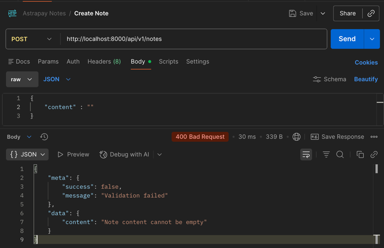
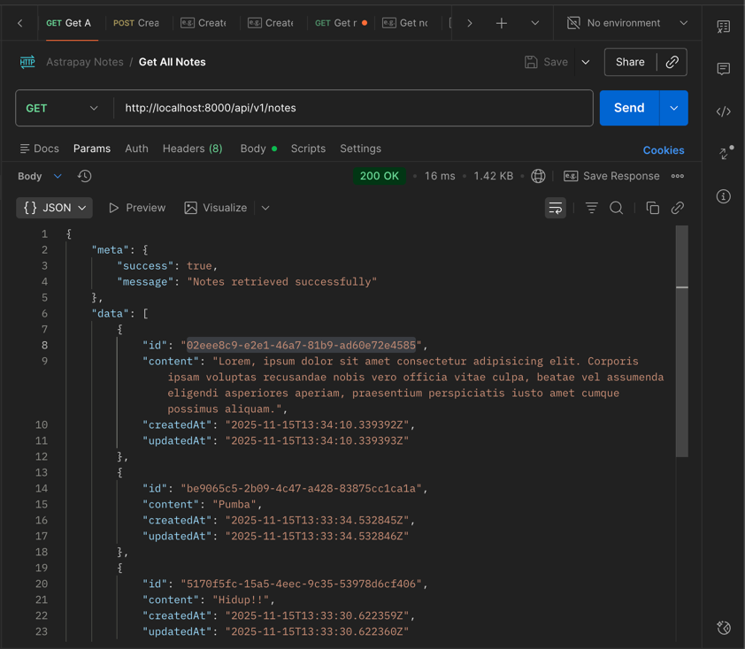
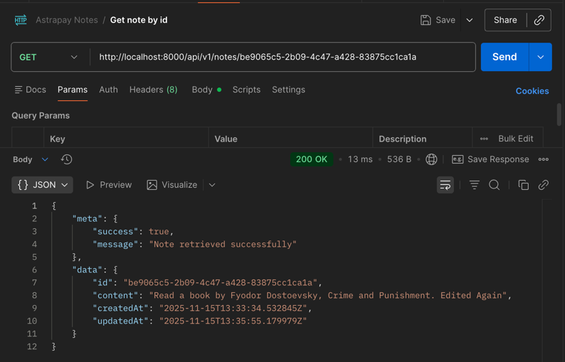
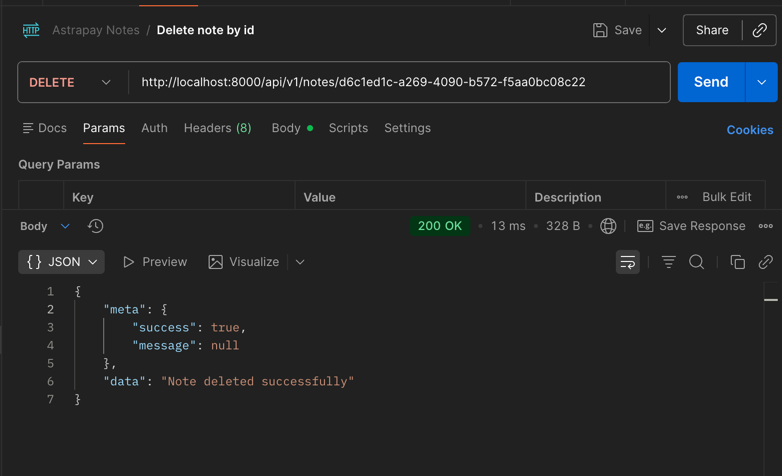
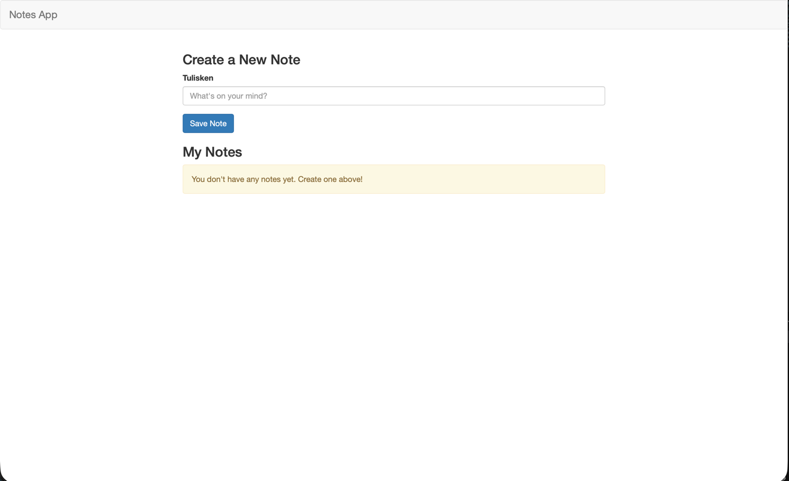
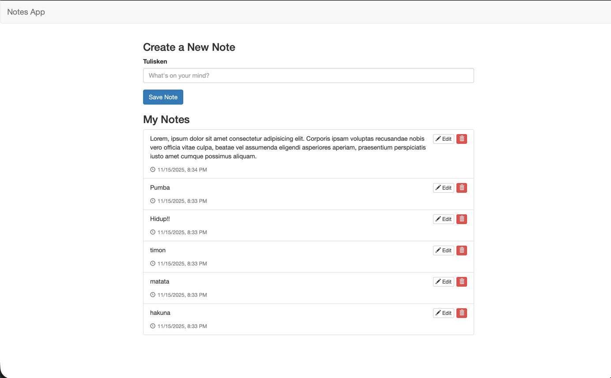
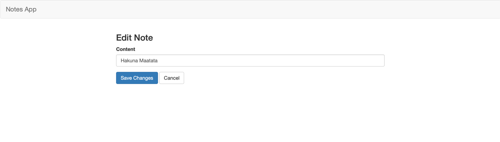
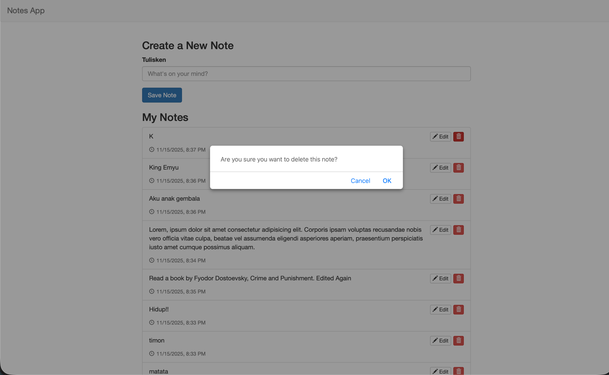

# Simple Notes Application

A simple Notes application 

---

## **Table of Contents**

- [Features](https://github.com/egasa21/astrapay-spring-boot-external/tree/master#features)

- [Technology Stack](https://github.com/egasa21/astrapay-spring-boot-external/tree/master#technology-stack)

- [Project Structure](https://github.com/egasa21/astrapay-spring-boot-external/tree/master#project-structure)

- [API Endpoints](https://github.com/egasa21/astrapay-spring-boot-external/tree/master#api-endpoints)

- [Request & Response Format](https://github.com/egasa21/astrapay-spring-boot-external/tree/master#request--response-format)

- [Running the Application](https://github.com/egasa21/astrapay-spring-boot-external/tree/master#running-the-application)

- [Validation & Error Handling](https://github.com/egasa21/astrapay-spring-boot-external/tree/master#validation--error-handling)

---

## **Features**

- Create a new note

- Retrieve all notes

- Retrieve a note by ID

- Update a note by ID

- Delete a note by ID

- In-memory data storage (no database)

- Consistent API response structure with `ApiResponse`

- Input validation with descriptive error messages

- Exception handling with proper HTTP status codes


---

## **Technology Stack**

- Java 11

- Spring Boot

- Maven

- Lombok

---

## **Project Structure**

```
├── README.md
├── pom.xml
├── src
│   └── main
│       ├── java
│       │   └── com
│       │       └── astrapay
│       │           ├── NotesApplication.java
│       │           ├── configuration
│       │           │   └── CorsConfig.java
│       │           ├── controller
│       │           │   ├── NotesController.java
│       │           │   └── advice
│       │           │       └── NotesAdvice.java
│       │           ├── dto
│       │           │   ├── CreateNoteRequestDto.java
│       │           │   ├── NoteDto.java
│       │           │   └── response
│       │           │       └── ApiResponse.java
│       │           ├── entity
│       │           ├── enums
│       │           ├── exception
│       │           │   └── NotFoundException.java
│       │           ├── repository
│       │           │   └── NotesRepository.java
│       │           ├── security
│       │           ├── service
│       │           │   ├── NotesService.java
│       │           │   └── model
│       │           │       └── NoteModel.java
│       │           └── validator
│       └── resources
│           └── application.properties
```

---

## **API Endpoints**

Base URL: `/api/v1/notes`

|Method|Endpoint|Description|Response Status|
|---|---|---|---|
|POST|`/`|Create a new note|201 Created|
|GET|`/`|Get all notes|200 OK|
|GET|`/{id}`|Get note by ID|200 OK / 404 Not Found|
|PUT|`/{id}`|Update note by ID|200 OK / 404 Not Found|
|DELETE|`/{id}`|Delete note by ID|200 OK / 404 Not Found|

---

## **Request & Response Format**

### **Request Example: Create or Update Note**

```json
POST /api/v1/notes
{
  "content": "Buy groceries"
}
```

### **Successful Response**

```json
{
  "meta": {
    "success": true,
    "message": "Note created successfully"
  },
  "data": {
    "id": "123e4567-e89b-12d3-a456-426614174000",
    "content": "Buy groceries",
    "createdAt": "2025-11-15T10:00:00Z"
  }
}
```

### **Validation Error Response**

```json
{
  "meta": {
    "success": false,
    "message": "Validation failed"
  },
  "data": {
    "content": "Note content cannot be empty"
  }
}
```

### **Not Found Response**

```json
{
  "meta": {
    "success": false,
    "message": "Note with id: 123e4567-e89b-12d3-a456-426614174000 not found"
  },
  "data": null
}
```

---

## **Running the Application**

Clone the repository:

```bash
git clone git@github.com:egasa21/astrapay-spring-boot-external.git
cd astrapay-spring-boot-external
```
### Running with IntelliJ IDEA (Recommended)

1. Open IntelliJ IDEA.

2. Select **File > Open...** and choose the project's root `pom.xml` file.

3. IntelliJ will automatically detect it as a Maven project and download all dependencies (this replaces `mvn clean install`).

4. Wait for the indexing to complete.

5. Find the main application class (the one annotated with `@SpringBootApplication`).

6. Click the green "play" icon next to the class or the `main` method and select **"Run 'YourApplicationName.main()'"**.


The server will start, and the API will be available at `http://localhost:8000`.

---

## **Validation & Error Handling**

- All requests are validated using **JSR-380 Bean Validation**.
- Errors return a consistent `ApiResponse` with `success: false`.
- `NotFoundException` is thrown for any missing note, returning **404 Not Found**.

---

## **Postman Documentation**

The full API documentation with sample requests and responses is available on **Postman**:

[View Notes API on Postman](https://documenter.getpostman.com/view/10017926/2sB3WvNyTv)

- Explore all endpoints: `POST`, `GET`, `PUT`, `DELETE`

- Includes request bodies and example responses


> You can also use the **Postman "Run in Postman" button** to import the collection directly into your workspace.

## Screenshots

## a. Successful Validation (Backend Tests)



## b. Postman API Implementation Details

1. GET All Notes (GET /api/v1/notes)


2. GET Note by ID (GET /api/v1/notes/{id})


3. Create Note (POST /api/v1/notes)


4. Update Note (PUT /api/v1/notes/{id})


5. Delete Note (DELETE /api/v1/notes/{id})


## c. Application - Empty List Page

### d. Application - Page with 6 Notes


### e. Application - Edit Page


### f. Application - Delete Confirmation Page
